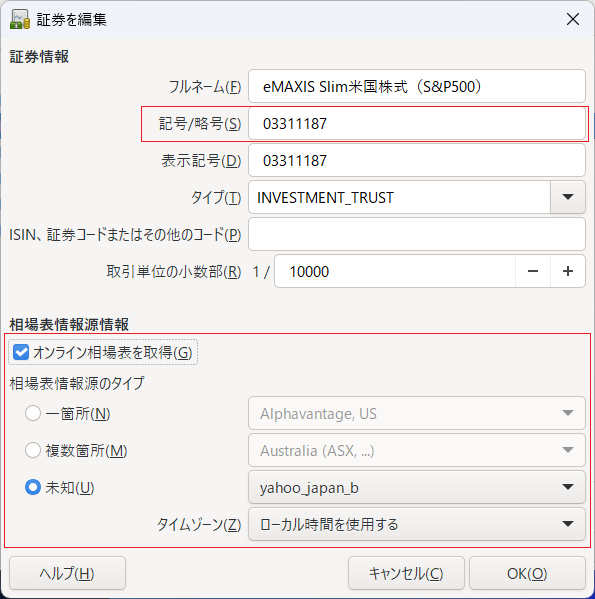

# Yahoo Japan Quotelet概要
- Yahoo Japan QuoteletはPerlの[Finance::Quote](http://finance-quote.sourceforge.net/)モジュールに組み込むカスタムQuoteletです。  
- Yahoo Japan QuoteletによりFinance::QuoteのAPIを使用して[Yahoo! Japanファイナンス](https://finance.yahoo.co.jp/)のサイトから投資信託等の評価額を取得することができます。  
- Finance::Quoteはフリーの財務ソフトウェアである[GnuCash](https://www.gnucash.org/)で評価額の自動取得のために使用されており、Yahoo Japan QuoteletはこのコンテキストでGnu Cashから呼び出して使用することを想定しています。  


## ファイルの説明
### Quoteletモジュール
|ファイル|説明|
|-----|----|
|lib/Finance/Quote/YahooJapanA.pm|yahoo_japan_a タイプのQuotelet.（Yahoo! JAPANファイナンスの古いレイアウト用で現在は機能しない）<br>Web::ScraperでstoksPriceを取得する。|
|lib/Finance/Quote/YahooJapanB.pm|yahoo_japan_b タイプのQuotelet.<br>HTML内のJSONをパースする。|

### サンプルコード
|ファイル|説明|
|-----|----|
|sample/sampleCurrencyExchangeRate.pl|Finance::Quoteによる為替レート取得のサンプル|
|sample/sampleStockPrice.pl|Finance::Quoteによる株価取得のサンプル|
|sample/sampleYahooJapanB|Finance::QuoteでYahooJapanB Quoteletを使用して投資信託の評価額を取得するサンプル|

### テストコード
|ファイル|説明|
|-----|----|
|t/testYahooJapanB.t|YahooJapanBモジュールのテストコード|

### スクリプト
|ファイル|説明|
|-----|----|
|script/install.sh|YahooJapanB Quoteletをインストールするスクリプト|
|script/updateFQ.pl|インストールスクリプトから呼ばれるPerlのスクリプト<br>（Finance::QuoteのQuote.pmを更新してYahooJapanB Quoteletを組み込む）|

## インストール方法
- 前提モジュール  
下記のモジュールがインストール済であることが前提です。
  - Perl  
  - Finance::Quote  
  - ~~Web::Scraper~~ ←YahooJapanAのみで必要なため現在は不要
- インストール概要
  - Finance::QuoteのモジュールがあるディレクトリのQuoteletをコピー
  - Finance::QuoteのQuote.pmを更新して`@MODULES`配列に`YahooJapanB`を追加
  - テストを実施してインストールが正常に行われていることを確認
- インストール手順
  - `script/install.sh`を実行する。（上記のインストール概要にある処理を実行します。実行前にスクリプトの内容と環境の整合性が取れていることを確認してください）
  ```
  $ ./script/install.sh
  ```

## GnuCashの設定方法
YahooJapanB QuoteletをGnuCashで使用するには証券エディターで対象の投資信託のオンライン取得情報を設定します。  
- 「記号／略号」にYahoo! JAPANファイナンスのコード（対象商品のページの左上に出る数値）を設定
- 「オンライン相場表を取得」のチェックを有効にして「未知」を選択し、「yahoo_japan_b」を設定


評価額を取得するには価格データベースで「相場表を取得」をクリックします。  


## （参考） 開発メモ
- `%info`の`success`を`0`で戻すとGnuCash上はシステムエラーとはならない。（見積もりが取得できなかったという扱いになる）  
- 平日の相場が開く前のタイミングでは価格に`---`が戻される。YahooJapanAではこれを`success=1（取得エラー）`として扱っている。  