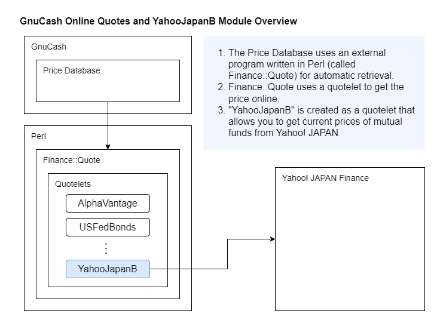

# Yahoo Japan Quotelet概要
- Yahoo Japan QuoteletはPerlの[Finance::Quote](http://finance-quote.sourceforge.net/)モジュールに組み込むカスタムQuoteletです。  
- Yahoo Japan QuoteletによりFinance::QuoteのAPIを使用して[Yahoo! Japanファイナンス](https://finance.yahoo.co.jp/)のサイトから投資信託等の評価額を取得することができます。  
- Finance::Quoteはフリーの財務ソフトウェアである[GnuCash](https://www.gnucash.org/)で評価額の自動取得のために使用されており、Yahoo Japan QuoteletはこのコンテキストでGnu Cashから呼び出して使用することを想定しています。  



## ファイルの説明
[モジュール]
```
Finance/Quote/YahooJapanA.pm : yahoo_japan_a タイプのQuotelet（古いHTML用。Web::ScraperでstoksPriceを取得）
Finance/Quote/YahooJapanB.pm : yahoo_japan_b タイプのQuotelet（新しいHTML用。HTML内のJSONをパース）
```
[テストコード]
```
testFinanceQuote.pl : FinanceQuoteの実行デモ
testYahooJapanA.pl  : YahooJapanAモジュールのテストコード
testYahooJapanB.pl  : YahooJapanBモジュールのテストコード
```

## インストール方法
- 前提モジュール  
下記のモジュールをインストールする。Macの場合Perlはデフォルトでインストールされている。  
```
- Perl  
- Finance::Quote  
- Web::Scraper
```
- Perlのモジュールディレクトリの下記のパスにモジュールをコピー（パスは環境に依存するため適切に読み替える）
```
/Library/Perl/5.28/Finance/Quote
```
- 下記のファイルを編集し、177行目あたりの`@modules`を読み込んでいる箇所に`YahooJapanA`, `YahooJapanB`を追加
```
/Library/Perl/5.28/Finance/Quote.pm
```
追加部分のイメージ
```
@modules = qw/AEX AIAHK AlphaVantage ASEGR ASX BMONesbittBurns BSERO Bourso Cdnfundlibrary Citywire CSE Currencies DekaDWS FTPortfolios Fidelity FidelityFixed FinanceCanada FoolFTfunds HU GoldMoney HEX IndiaMutual LeRevenuManInvestments Morningstar MorningstarJP MStaruk NZXPlatinum SEB SIXfunds SIXshares StockHouseCanada TSP TSXTdefunds Tdwaterhouse Tiaacref TNetuk Troweprice TrustnetUnion USFedBonds VWD ZA Cominvest Finanzpartner YahooJSONYahoo::Asia Yahoo::Australia Yahoo::Brasil Yahoo::EuropeYahoo::NZ Yahoo::USA YahooYQL ZA_UnitTrusts YahooJapanA YahooJapanB/; }
```

## 開発ノート
- `%info`の`success`を`0`で戻すとGnuCash上は（システムエラーではなく）見積もりが取得できなかったという扱いになる。  
- 平日の相場が開く前のタイミングでは価格に`---`が戻される。YahooJapanAではこれを`success=1（取得エラー）`として扱っている。  

## ToDoList
- GnuCashでの設定方法を記載  
- 単体テストコードの作成  
